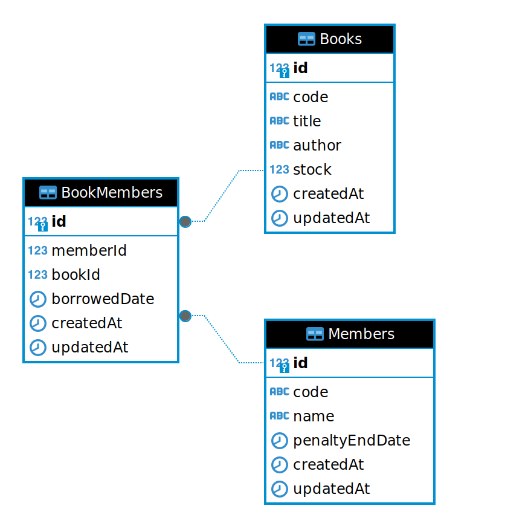

# Sistem Manajemen Peminjaman Buku

Aplikasi sistem manajemen peminjaman buku yang memungkinkan peminjaman dan pengembalian buku oleh anggota, serta pengecekan buku dan anggota. API ini dilengkapi dengan dokumentasi menggunakan Swagger.

## ERD (Entity-Relationship Diagram)

Berikut adalah diagram ERD (Entity-Relationship Diagram) untuk sistem manajemen peminjaman buku:



## Daftar Isi

-   [Instalasi](#instalasi)
-   [Penggunaan](#penggunaan)
-   [Dokumentasi API](#dokumentasi-api)

## Instalasi

1. **Clone Repository**

    ```bash
    git clone https://github.com/username/repository.git
    cd repository

    ```

2. **Instalasi Dependensi**

    Pastikan Anda sudah memiliki Node.js terinstal. Kemudian jalankan perintah berikut untuk menginstal semua paket yang diperlukan:

    ```bash
    npm install
    ```

## Konfigurasi

1. **Buat `.env` file**

    Copy isi dari `.env.example` file ke `.env` and update dengan kredensial database PostgreSQL yang dimiliki:

    ```bash
    cp .env.example .env
    ```

    **`.env` Example:**

    ```env
    POSTGRES_USERNAME=postgres
    POSTGRES_PASSWORD=postgres
    POSTGRES_DATABASE=library_management
    POSTGRES_HOST=127.0.0.1
    ```

## Database Setup

1. **Buat database**

    Pastikan PostgreSQL telah berjalan, and buat database menggunakan command:

    ```bash
    npx sequelize-cli db:create
    ```

2. **Run migrations**

    Terapkan migrations untuk mmebuat table yang diperlukan:

    ```bash
    npx sequelize-cli db:migrate
    ```

3. **Seed the database**

    Isi table pada database dengan data awal:

    ```bash
    npx sequelize-cli db:seed:all
    ```

## Running the Application

1. **Mulai server**

    ```bash
    npm run dev
    ```

    Server akan berjalan di [http://localhost:3000](http://localhost:3000) secara default.

2. **Mengakses Dokumentasi API**

    Dokumentasi API dapat diakses di http://localhost:3000/api-docs. Ini menggunakan Swagger untuk memberikan dokumentasi interaktif dan mudah dipahami tentang semua endpoint API.

## API Endpoints

### **Borrow Book**

-   **Endpoint:** `POST /api/v1/borrow`
-   **Request Body:**

    ```json
    {
        "memberCode": "M001",
        "bookCode": "JK-45"
    }
    ```

-   **Response:**

    ```json
    {
        "message": "Book borrowed successfully"
    }
    ```

### **Return Book**

-   **Endpoint:** `POST /api/v1/return`
-   **Request Body:**

    ```json
    {
        "memberCode": "M001",
        "bookCode": "JK-45",
        "returnDate": "2024-08-28"
    }
    ```

-   **Response:**

    ```json
    {
        "message": "Book returned successfully"
    }
    ```

### **Check Books**

-   **Endpoint:** `GET /api/v1/books`
-   **Response:**

    ```json
    [
      {
        "code": "JK-45",
        "title": "Harry Potter",
        "author": "J.K Rowling",
        "availableStock": 1
      },
      ...
    ]
    ```

### **Check Members**

-   **Endpoint:** `GET /api/v1/members`
-   **Response:**

    ```json
    {
        "data": [
            {
                "code": "M001",
                "name": "Angga",
            },
            ...
        ]
    }
    ```
